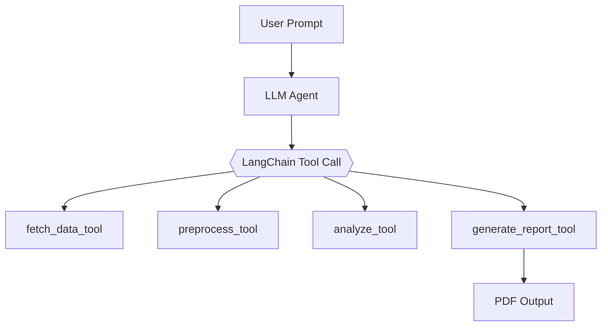

# Agentic Black Hole Detection

**Team Members:**  
Krish Nangia (`knang2`) and Sidharth Anand (`sanand12`)  

**Course:** ECE 498 Section BH3 - LLM Reasoning for Engineering  
**Submission Date:** May 21, 2025  
**Project Topic:** Agentic Gravitational Wave Detection  
**Repository:** [github.com/knangia04/agentic-blackhole-detection](https://github.com/knangia04/agentic-blackhole-detection)

---

## Project Overview

We present a fully autonomous, agentic system for black hole merger detection using real gravitational wave data. A Large Language Model (LLM) orchestrates tool-augmented subagents for data fetching, preprocessing, matched filtering, signal detection, and PDF report generation.

Users can interact via a natural language or parameter-driven **Streamlit interface**, receiving detailed scientific outputs with waveform plots, signal-to-noise ratios (SNR), and detector coincidence analysis. Our system supports comparative event queries and real-time PDF export.

---

## Architecture Overview

- **LLM Orchestrator:** Using Mistral Small 3.1 24B LLM model, the orchestrator routes analysis through LangChain tools based on natural prompts (e.g., “Generate a report for GW150914”).
- **LangChain Tools:** Implemented for data fetching, preprocessing, analysis, and report generation.
- **Event Metadata Resolver:** Maps event names like `GW170817` to mass, distance, and GPS time.
- **Streamlit UI:** Interactive frontend supporting both free-form and manual input.
- **Outputs:** Automatically generated scientific PDF reports with matched filter plots and summary statistics.

---

## Methodology

### Event-Aware Processing
Each known GW event is mapped to astrophysical metadata. For the sake of simplicity, we have only used these variables for our metadata:
- `mass1`, `mass2` in M☉
- `distance` in Mpc
- `gps_event` timestamp

This metadata is injected automatically unless overridden by user input.

### Detection Pipeline
1. **Remote Fetch Data** using `GWpy` for detectors like H1 and L1.
2. **Preprocess:** Whitening, bandpass filtering, and cropping.
3. **Matched Filtering:** Using `PyCBC`, generate template waveforms and compute SNR time series.
4. **Signal Detection:** Evaluate peak SNR values and timing for each detector.
5. **Coincidence Analysis:** Compare detection times across detectors.
6. **Report Generation:** Create annotated plots and export to PDF.

---

## LangChain-Based Agent Workflow



---

## Streamlit Interface

The system can be used via:

- **Prompt Mode**:  
  _"Generate a comparative report on GW150914 and GW170814."_

- **Manual Mode**:  
  Select event name and detector configuration, override mass and distance.

The UI persistently tracks PDF generation and allows download without state loss.

---

## Example Prompt

> “Generate a comparative PDF report on GW150914 and GW170817, including waveform shape and SNR.”

LLM automatically:
- Resolves event metadata
- Fetches strain data from detectors
- Applies matched filter
- Evaluates signal significance
- Outputs downloadable reports

---

## How to Run the Agent

To run the full agentic detection system and interactive interface:

### 1. Install Dependencies

Clone the repository and install the required Python packages:

```bash
git clone https://github.com/knangia04/agentic-blackhole-detection.git
cd agentic-blackhole-detection
pip install -r requirements.txt
```

### 2. Launch the Streamlit Interface

Start the web interface:

```bash
streamlit run streamlit_app.py
```

This will open a local app at [http://localhost:8501](http://localhost:8501).

### 3. Use the Interface

Choose one of the two modes:
- **Prompt Mode:** Ask natural language queries like  
  > _"Generate a report on GW150914 and GW151226."_

- **Manual Mode:** Select a known event (e.g., `GW170817`) and optionally override mass/distance.

### 4. Download Reports

After analysis, PDFs are presented for download. You can:
- Download reports individually
- Generate multiple reports in one run
- Persist UI state across downloads

---

## Literature Survey Highlights

- **Shi et al. (2023)** introduce CBS-GPT, a transformer-based model for synthesizing gravitational waveforms from compact binary systems.  
  [https://arxiv.org/abs/2310.2017](https://arxiv.org/abs/2310.2017)
- **Chatterjee et al. (2024)** adapt OpenAI's Whisper model for gravitational wave detection.  
  [https://arxiv.org/abs/2412.20789](https://arxiv.org/abs/2412.20789)
- **Ruiz (2023)** explores CNNs for GW signal classification.  
  [https://diposit.ub.edu/dspace/handle/2445/201012](https://diposit.ub.edu/dspace/handle/2445/201012)
- **Marx et al. (2024)** present a real-time ML pipeline for compact binary coalescence detection.  
  [https://journals.aps.org/prd/abstract/10.1103/PhysRevD.111.042010](https://journals.aps.org/prd/abstract/10.1103/PhysRevD.111.042010)
- **Zhao et al. (2023)** review AI in GW research.  
  [https://arxiv.org/abs/2311.15585](https://arxiv.org/abs/2311.15585)

---

## Data Sources

- **GWTC Catalog:**  
  [https://gwosc.org/eventapi/html/GWTC](https://gwosc.org/eventapi/html/GWTC)

- **GWOSC Strain Data (O1–O3):**  
  [https://gwosc.org/data](https://gwosc.org/data)

---

## Appendix A: Subagent Design

| Subagent               | Role                                                         |
|------------------------|--------------------------------------------------------------|
| `fetch_data_tool`      | Downloads raw H1/L1 strain data using GWpy                  |
| `preprocess_tool`      | Applies whitening, filtering, and cropping                  |
| `analyze_tool`         | Performs matched filtering and signal detection             |
| `generate_report_tool` | Generates plots and PDF summary                             |
| `resolve_event_metadata` | Extracts parameters from known GW event names           |

---

## Technologies Used

- `Python`, `GWpy`, `PyCBC`
- `LangChain`, `OpenAI`, `Pydantic`
- `Matplotlib`, `NumPy`, `Streamlit`
