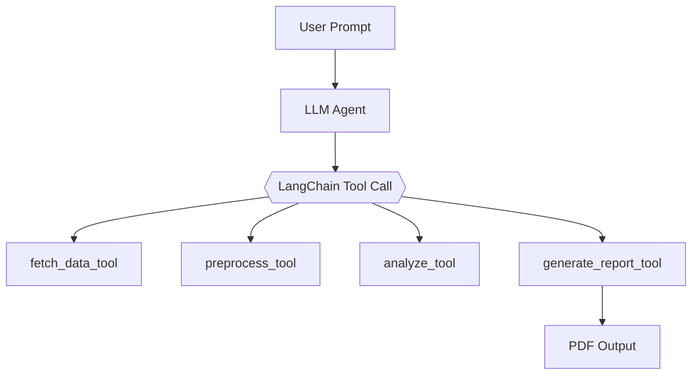

# Agentic Black Hole Detection

**Team Members:**  
Krish Nangia (`knang2`) and Sidharth Anand (`sanand12`)  

**Course:** ECE 498 Section BH3  
**Submission Date:** May 21, 2025  
**Project Topic:** Agentic Gravitational Wave Detection  
**Repository:** [github.com/SidharthAnand04/agentic-blackhole-detection](https://github.com/SidharthAnand04/agentic-blackhole-detection)

---

## Project Overview

We present a fully autonomous, agentic system for black hole merger detection using real gravitational wave data. A Large Language Model (LLM) orchestrates tool-augmented subagents for data fetching, preprocessing, matched filtering, signal detection, and PDF report generation.

Users can interact via a natural language or parameter-driven **Streamlit interface**, receiving detailed scientific outputs with waveform plots, signal-to-noise ratios (SNR), and detector coincidence analysis. Our system supports comparative event queries and real-time PDF export.

---

## Architecture Overview

- **LLM Orchestrator:** Routes analysis through LangChain tools based on natural prompts (e.g., “Generate a report for GW150914”).
- **LangChain Tools:** Implemented for data fetching, preprocessing, analysis, and report generation.
- **Event Metadata Resolver:** Maps event names like `GW170817` to mass, distance, and GPS time.
- **Streamlit UI:** Interactive frontend supporting both free-form and manual input.
- **Outputs:** Automatically generated scientific PDF reports with matched filter plots and summary statistics.

---

## Methodology

### Event-Aware Processing
Each known GW event is mapped to astrophysical metadata:
- `mass1`, `mass2` in M☉
- `distance` in Mpc
- `gps_event` timestamp

This metadata is injected automatically unless overridden by user input.

### Detection Pipeline
1. **Remote Fetch Data** using `GWpy` for detectors like H1 and L1.
2. **Preprocess:** Whitening, bandpass filtering, and cropping.
3. **Matched Filtering:** Using `PyCBC`, generate template waveforms and compute SNR time series.
4. **Signal Detection:** Evaluate peak SNR values and timing for each detector.
5. **Coincidence Analysis:** Compare detection times across detectors.
6. **Report Generation:** Create annotated plots and export to PDF.

---

## LangChain-Based Agent Workflow

---

## Streamlit Interface

The system can be used via:

- **Prompt Mode**:  
  _"Generate a comparative report on GW150914 and GW170814."_

- **Manual Mode**:  
  Select event name and detector configuration, override mass and distance.

The UI persistently tracks PDF generation and allows download without state loss.

---

## Literature Survey Highlights

- **Shi et al. (2023)** introduce CBS-GPT, a transformer-based model for synthesizing gravitational waveforms from compact binary systems. Its high accuracy and generalization make it ideal for augmenting waveform datasets in detection pipelines.  
  [https://arxiv.org/abs/2310.2017](https://arxiv.org/abs/2310.2017)
- **Chatterjee et al. (2024)** adapt OpenAI's Whisper model for gravitational wave detection, demonstrating that audio-pretrained transformers can classify astrophysical signals and reject noise artifacts. This supports our use of transfer learning in the detection stack.  
  [https://arxiv.org/abs/2412.20789](https://arxiv.org/abs/2412.20789)
- **Ruiz (2023)** explores CNNs, both human-designed and GPT-generated, for GW signal classification. The findings support generative model use in automated architecture design.  
  [https://diposit.ub.edu/dspace/handle/2445/201012](https://diposit.ub.edu/dspace/handle/2445/201012)
- **Marx et al. (2024)** present a real-time machine learning pipeline for detecting compact binary coalescences, replacing traditional filtering with neural networks to reduce latency. Their approach informs our system's real-time design.  
  [https://journals.aps.org/prd/abstract/10.1103/PhysRevD.111.042010](https://journals.aps.org/prd/abstract/10.1103/PhysRevD.111.042010)
- **Zhao et al. (2023)** review AI applications in GW research, highlighting advances in signal detection, parameter estimation, and waveform modeling. Their synthesis contextualizes our approach within broader AI developments.  
  [https://arxiv.org/abs/2311.15585](https://arxiv.org/abs/2311.15585)

---

## Data Sources

- **GWTC Catalog:**  
  Event metadata and PE samples — [gwosc.org/eventapi/html/GWTC](https://gwosc.org/eventapi/html/GWTC)

- **GWOSC Strain Data (O1–O3):**  
  Raw LIGO/Virgo data for analysis — [gwosc.org/data](https://gwosc.org/data)

---

## Appendix A: Subagent Design

| Subagent           | Role                                                                 |
|--------------------|----------------------------------------------------------------------|
| `fetch_data_tool`  | Downloads raw H1/L1 strain data using GWpy                          |
| `preprocess_tool`  | Applies whitening, filtering, and cropping                          |
| `analyze_tool`     | Performs matched filtering and signal detection                     |
| `generate_report_tool` | Generates plots and PDF summary                                |
| `resolve_event_metadata` | Extracts parameters from known GW event names               |

Each tool conforms to the LangChain tool interface for seamless LLM invocation.

---

## Technologies Used

- `Python`, `GWpy`, `PyCBC`
- `LangChain`, `OpenAI`, `Pydantic`
- `Matplotlib`, `NumPy`, `Streamlit`

---

## Example Prompt

> “Generate a comparative PDF report on GW150914 and GW170817, including waveform shape and SNR.”

LLM automatically:
- Resolves event metadata
- Fetches strain data from detectors
- Applies matched filter
- Evaluates signal significance
- Outputs downloadable reports
